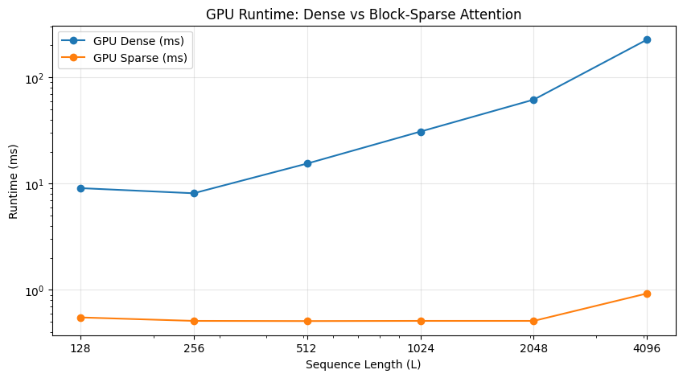

# Sparse Attention CUDA: Block-Diagonal and Streaming Patterns

## Overview

This project implements and benchmarks two sparse attention patterns in CUDA, comparing their performance against dense attention. Both methods reduce computational complexity from O(L²) to achieve significant speedups on long sequences.

## Methods

### 1. Block-Diagonal Sparse Attention

**Concept**: Partition the sequence into non-overlapping blocks of size B. Each token attends only to tokens within its block, creating a block-diagonal attention pattern.

**Implementation** (`block_sparse_att.cu`):
- Sequence length L divided into blocks of size B
- Attention computed only within each block: `[b*B, (b+1)*B)`
- Complexity: O(L²/B) vs O(L²) for dense
- Memory: Reduces attention matrix from L×L to L×B per block

**Use Case**: Effective when local context within blocks is sufficient, with no need for cross-block dependencies.

### 2. Streaming Attention (Sink + Sliding Window)

**Concept**: Combine global context (sink tokens) with local context (sliding window) to maintain both long-range dependencies and recent information.

**Implementation** (`streaming_att.cu`):
- **Sink Tokens**: First K tokens (default: 16) always attended by all positions
- **Sliding Window**: Each token attends to last W tokens (default: 64) in addition to sinks
- Complexity: O(L × (K + W)) vs O(L²) for dense
- Memory: Constant per-token memory regardless of sequence length

**Use Case**: Ideal for streaming scenarios where maintaining global context (sinks) and recent context (window) is critical.

## Performance Results

### Streaming Attention

```
============================================================
SUMMARY TABLE
============================================================
T        Dense (ms)   Streaming (ms)  Speedup   
------------------------------------------------------------
128      5.597        4.497           1.24      x
256      11.884       6.982           1.70      x
512      23.127       6.814           3.39      x
1024     49.234       6.811           7.23      x
2048     128.344      6.894           18.62     x
4096     276.721      7.210           38.38     x
```

**Key Observations**:
- Streaming runtime remains nearly constant (~7ms) as sequence length increases
- Dense runtime grows quadratically: 5.6ms → 276.7ms (49× increase)
- Speedup scales with sequence length: **38.38× at T=4096**


### Block-Diagonal Sparse Attention

```
GPU Runtime Table (ms)
L        Dense        Sparse        Speedup
128      9.075        0.551         16.47×
256      8.118        0.511         15.89×
512      15.442       0.509         30.34×
1024     30.883       0.511         60.44×
2048     61.726       0.511         120.80×
4096     226.757      0.926         244.66×
```

**Key Observations**:
- Block-diagonal maintains constant runtime (~0.5ms) up to T=2048
- Dense runtime grows quadratically: 9.1ms → 226.8ms (25× increase)
- Speedup increases dramatically: **244.66× at T=4096**
- Block size B=16 used for all tests



## Comparison

| Method | Complexity | Constant Runtime | Max Speedup | Global Context |
|--------|-----------|------------------|-------------|----------------|
| **Dense** | O(L²) | No | 1× | Full |
| **Block-Diagonal** | O(L²/B) | Yes (up to ~2K) | 244.66× | None (block-local) |
| **Streaming** | O(L × (K+W)) | Yes | 38.38× | Yes (sink tokens) |

**Trade-offs**:
- **Block-Diagonal**: Highest speedup but loses global context; best for tasks where local blocks are sufficient
- **Streaming**: Maintains global context via sinks while achieving significant speedup; ideal for streaming/long-context scenarios

## Implementation Details

### Kernel Design
- **Dense**: One thread per sequence position, computes attention over all previous tokens
- **Block-Diagonal**: One thread per position, computes attention only within block boundaries
- **Streaming**: One thread per position, builds compact key list (sinks + window), then computes attention

### Memory Layout
- All tensors flattened row-major: `[batch * T + token] * C + channel`
- Fixed batch size B=1, channel dimension C=384 (streaming) or d=64 (block-diagonal)
- Compile-time constant arrays to avoid dynamic allocation in kernels

### Compilation
```bash
# Streaming attention
nvcc -O3 -std=c++17 -arch=sm_80 --expt-relaxed-constexpr streaming_att.cu -o streaming_att

# Block-diagonal sparse
nvcc -O3 -std=c++17 -arch=sm_80 block_sparse_att.cu -o block_sparse_att
```

## Usage

### Streaming Attention
```bash
./streaming_att [T] [window_size] [sink_size]
# Example: ./streaming_att 1024 64 16
```

### Block-Diagonal Sparse
```bash
./block_sparse_att [L] [d] [B]
# Example: ./block_sparse_att 512 64 16
```

## Technical Notes

- CUDA architecture target: `sm_80` (Ampere: A100, RTX A6000)
- Custom `min_val`/`max_val` functions to avoid nvcc compilation issues
- Numerical stability: max subtraction before softmax
- Causal masking: no future token attention

## Note on Benchmark Hardware

The block-diagonal sparse attention benchmarks were run on a **T4 GPU**, while streaming attention benchmarks were run on an **RTX A6000**. This explains the discrepancy in dense attention timings between the two tables—the T4's slower compute capability results in higher absolute dense times, though the relative speedup patterns remain consistent across both implementations.
