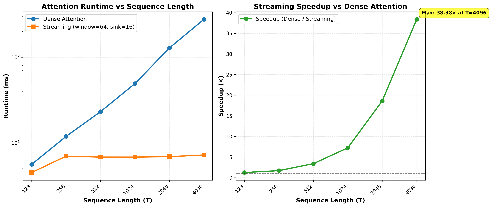

# Streaming Attention CUDA Implementation

## Overview

This project implements and benchmarks **streaming attention** (sink tokens + sliding window) in CUDA, comparing its performance against dense attention. Streaming attention is a sparse attention pattern that maintains global context through sink tokens while using a local sliding window for efficiency.

### What We Achieved

- **Dense Attention**: Full O(T²) attention computation where every token attends to all previous tokens
- **Streaming Attention**: Sparse attention pattern combining:
  - **Sink Tokens**: First K tokens (default: 16) that are always attended to by all positions (global context)
  - **Sliding Window**: Each token attends to the last W tokens (default: 64) in addition to sinks (local context)
- **Performance Comparison**: Comprehensive benchmarking showing the speedup benefits of streaming attention, especially for long sequences

### Key Features

- Runtime-configurable sequence length (T), window size, and sink size
- CUDA-optimized kernels with compile-time constant array sizes
- Supports sequence lengths up to 4096 tokens
- Efficient memory access patterns
- Causal masking (no future token attention)

## Performance Results

### Benchmark Summary

The following table shows runtime comparison between dense and streaming attention across different sequence lengths:

```
============================================================
SUMMARY TABLE
============================================================
T        Dense (ms)   Streaming (ms)  Speedup   
------------------------------------------------------------
128      5.597        4.497           1.24      x
256      11.884       6.982           1.70      x
512      23.127       6.814           3.39      x
1024     49.234       6.811           7.23      x
2048     128.344      6.894           18.62     x
4096     276.721      7.210           38.38     x
```

**Key Observations:**
- Streaming attention runtime stays relatively constant (~7ms) as sequence length increases
- Dense attention runtime grows quadratically with sequence length
- Speedup increases dramatically with longer sequences: **38.38× faster at T=4096**
- Streaming attention achieves near-constant time complexity O(T) vs dense O(T²)

### Performance Plots



The plots show:
- **Left**: Runtime comparison on log-log scale - dense attention grows exponentially while streaming stays flat
- **Right**: Speedup factor - demonstrates how streaming attention becomes increasingly advantageous for longer sequences

## Building and Running

### Compilation

```bash
nvcc -O3 -std=c++17 -arch=sm_80 --expt-relaxed-constexpr attention.cu -o attention_compare
```

### Basic Usage

```bash
# Run with default parameters (T=1024, window=64, sink=16)
./attention_compare

# Custom sequence length
./attention_compare 2048

# Custom window and sink sizes
./attention_compare 2048 128 32
```

### Benchmarking and Plotting

Run the automated benchmark script to generate performance plots:

```bash
# Install dependencies
pip install matplotlib numpy

# Run benchmark (tests T = 128, 256, 512, 1024, 2048, 4096)
python3 benchmark_plot.py

# Custom range
python3 benchmark_plot.py --T-min 256 --T-max 2048
```

## Implementation Details

### Kernel Design

- **Dense Kernel**: Each thread processes one (batch, token) pair, computing attention over all previous tokens
- **Streaming Kernel**: Each thread processes one (batch, token) pair, computing attention over:
  - Sink tokens (positions 0 to sink_size-1)
  - Local window tokens (last window_size tokens before current position)

### Memory Layout

- All tensors are flattened row-major: `[batch * T + token] * C + channel`
- Fixed batch size B=1, channel dimension C=384
- Maximum supported sequence length: T=4096

### Compile-Time Constants

- `MAX_T = 4096`: Maximum sequence length
- `MAX_KEYS = 512`: Maximum keys per query (window_size + sink_size)
- Arrays are sized at compile-time to avoid dynamic allocation in kernels

## Code Structure

- `attention.cu`: Main CUDA implementation with dense and streaming kernels
- `benchmark_plot.py`: Python script for automated benchmarking and visualization
- `README.md`: This file
- `README_benchmark.md`: Detailed benchmarking documentation

## Technical Notes

- Uses custom `min_val`/`max_val` functions to avoid nvcc compilation issues with `<algorithm>`
- CUDA architecture target: `sm_80` (Ampere, e.g., A100, RTX A6000)
- Compilation flag `--expt-relaxed-constexpr` enables relaxed constexpr evaluation

## Future Improvements

- Support for batch size > 1
- Multi-head attention
- Mixed precision (FP16/BF16)
- Flash Attention integration
- Dynamic shared memory for variable window sizes

